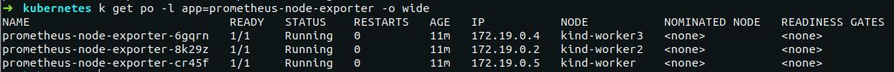
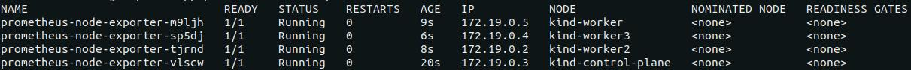

### Задание 1 (Обновление ReplicaSet)
---
**Вопрос:**  
  Почему обновление ReplicaSet не повлекло обновление запущенных pod?  

**Ответ:**  
  После изменения в манифесте ReplicaSet версии образа для контейнера `frontend` и применения этого манифеста, в кластере остались запущены поды со старой версией приложения, то есть новые поды не запустились вместо уже запущенных. Это произошло потому, что ReplicaSet следит только за тем, чтобы количество подов в кластере с определёнными лейблами (эти лейблы указаны в селекторе ReplicaSet), совпадало с числом реплик в поле `.spec.replicas`.  
  На момент изменения версии образа в спецификации ReplicaSet, количество запущенных контейнеров с лейблом `app: frontend` уже равнялось трём, поэтому ReplicaSet не стало пересоздавать новые поды с обновленной версией приложения.

### Задание 2 (Deployment | Задание со *)
---
**Выполнение**
  
***Реализация аналога blue-green развертывания:***
1. Развертывание трех новых pod
2. Удаление трех старых pod

Blue-green развертывание можно реализовать следующими параметрами секции `.spec` в манифесте deployment:

```yaml
strategy:
  type: RollingUpdate
  rollingUpdate:
    maxSurge: 100%        # сразу будут подняты все реплики с новой версией приложения (maxSurge: 100%),
    maxUnavailable: 0     # при этом старые реплики будут удалены только после того, как новые реплики будут готовы (maxUnavailable: 0)
```

Весь манифест находится в файле `kubernetes-controllers/paymentservice-deployment-bg.yaml`.

***Реализация аналога Reverse Rolling Update развертывания:***
1. Удаление одного старого pod
2. Создание одного нового pod
3. …

Reverse Rolling Update развертывание можно реализовать следующими параметрами секции `.spec` в манифесте deployment:

```yaml
strategy:
  type: RollingUpdate
  rollingUpdate:
    maxSurge: 0          # новая реплика приложения поднимется только после того (maxSurge: 0),
    maxUnavailable: 1    # как одна старая будет удалена (maxUnavailable: 1), и так далее, пока все старые реплики не будут заменены новыми
```

Весь манифест находится в файле `kubernetes-controllers/paymentservice-deployment-reverse.yaml`.

### Задание 3 (Probes)
---
 **Выполнение**
  
Создан манифест `kubernetes-controllers/frontend-deployment.yaml`, в котором добавлена Readiness Probe для периодеческого опроса эндпойнта `/_healthz` для контейнера `server`.

### Задание 4 (DaemonSet | Задание со *)
---
**Выполнение**
  
В кластере был развернут Node Exporter в виде DaemonSet.

За основу манифеста `kubernetes-controllers/node-exporter-daemonset.yaml` был взят сгенерированный манифест `daemonset.yaml` из шаблона helm-чарта `prometheus-community/prometheus-node-exporter` командой `helm template`.

На скриншоте показано, что поды с Node Exporter запустились только на worker нодах:


Для проверки, что метрики отдаются, после применения манифеста `node-exporter-daemonset.yaml` необходимо:
1. Пробросить порт в любой под с Node Exporter: `kubectl port-forward prometheus-node-exporter-6gqrn 9100:9100`
2. Запросить метрики командой `curl localhost:9100/metrics` или открыть в браузере адрес http://localhost:9100/metrics

### Задание 5 (DaemonSet | Задание со **)
---
**Выполнение**

Для запуска подов с Node Exporter на Control plane нодах в манифест `kubernetes-controllers/node-exporter-daemonset.yaml` необходимо добавить параметры `tolerations` в `.spec.template.spec`:

```yaml
tolerations:
  - key: node-role.kubernetes.io/control-plane
    operator: Exists
    effect: NoSchedule
```

Это укажет планировщику Kubernetes Scheduler для подов с Node Exporter игнорировать taint `node-role.kubernetes.io/control-plane:NoSchedule`, который добавлен на Control plane ноды кластера.

После применения манифеста `kubernetes-controllers/node-exporter-daemonset.yaml` с параметрами tolerations под с Node Exporter окажется запущен также и на Control plane ноде:

