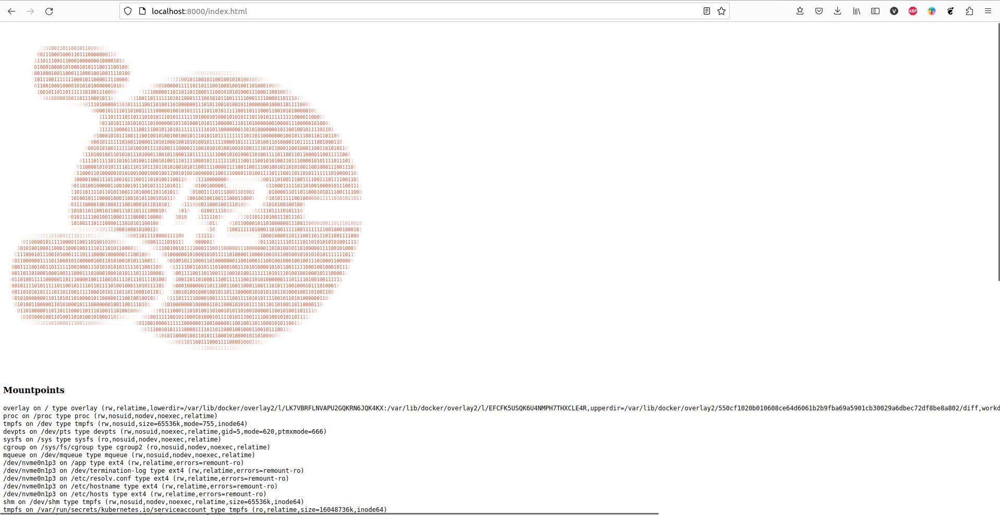

### Задание 1
---
**Вопрос:**  

  Разберитесь почему все pod в namespace `kube-system` восстановились после удаления.

**Ответ:**  

  В нэймспейсе `kube-system` (minikube) запускаются следующие поды:  
  - coredns  
  - etcd  
  - kube-apiserver  
  - kube-controller-manager  
  - kube-proxy  
  - kube-scheduler  
  - registry  
  - registry-proxy  

Поды `etcd`, `kube-apiserver`, `kube-controller-manager` и `kube-scheduler` являются static подами. Такие поды управляются напрямую `kubelet`'ом без участия компонентов Control Plane. `kubelet` следит за созданием/обновлением манифестов в директории `/etc/kubernetes/manifests` (по дефолту) и создает описанные в них поды без обращения к `kube-apiserver`. Собственно сам `kube-apiserver` и другие компоненты Control Plane создаются `kubelet`'ом при бутстрапе кластера (на самом деле это зависит от способа развертывания кластера, и Control Plane компоненты могут быть подняты как systemd сервисы, тогда манифесты для запуска их в виде static подов не нужны, как и сам `kubelet` на мастер-нодах).  

При удалении этих подов из нэймспейса `kube-system` kubelet заново их поднимает, опираясь на манифесты в директории `/etc/kubernetes/manifests`.
Под `coredns` заново поднимается после удаления, так как `coredns` является `deployment`'ом, и `deployment` контроллер следит, чтобы в кластере всегда было количество реплик, указанное в манифесте этого `deployment`.
Поды `kube-proxy` и `registry-proxy` поднимаются, так как развернуты в кластере в составе `replicaset`, а `registry` - в составе `replicationcontroller`. Поведение этих контроллеров при удалении подов не отличается от `deployment`'а - они всегда восстанавливают в кластере то количество реплик, которое указано в их манифесте.

### Задание 2
---
**Выполнение**

1. Написан Dockerfile, запускающий web-сервер NGINX на порту `8000`, отдающий содержимое директории `/app` внутри контейнера (например, если в директории `/app` лежит файл `homework.html`, то при запуске контейнера данный файл должен быть доступен по URL `http://localhost:8000/homework.html`) и работающий с UID `1001`.   
Dockerfile и конфиг для NGINX находится в директории `kubernetes-intro/web`. Образ собран и загружен в Docker Hub под тегом `vasiilij/nginx:k8s-intro`.
2. Создан манифест `kubernetes-intro/web-pod.yaml` для запуска пода с контейнером на основе образа `vasiilij/nginx:k8s-intro`.
3. В под к основному контейнеру добавлен init контейнер, генерирующий страницу `index.html`.
4. Работоспособность приложения проверена (скриншот ниже):

### Hipster Shop | Задание со *
---
**Выполнение**

1. Причиной, по которой падал pod `frontend`, было отсутствие переменных окружения, необходимых для работы приложения.
2. Создан манифест `kubernetes-intro/frontend-pod-healthy.yaml`, в котором для контейнера `frontend` указаны необходимые переменные окружения.
