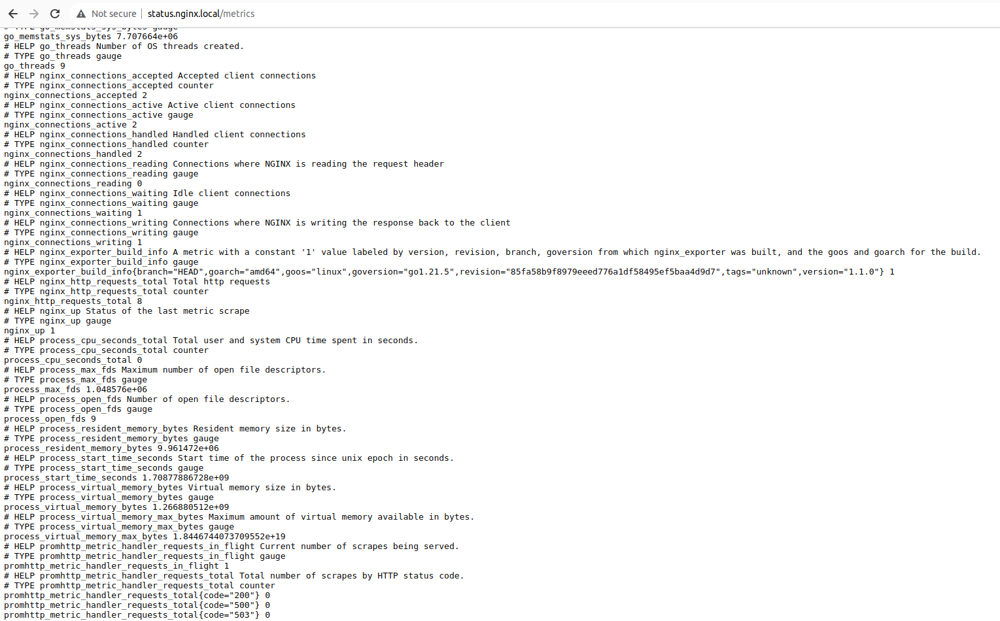
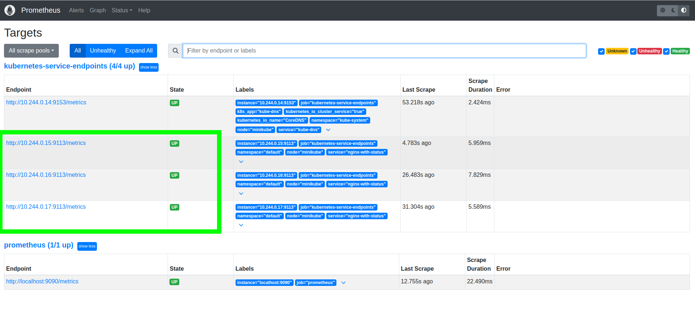
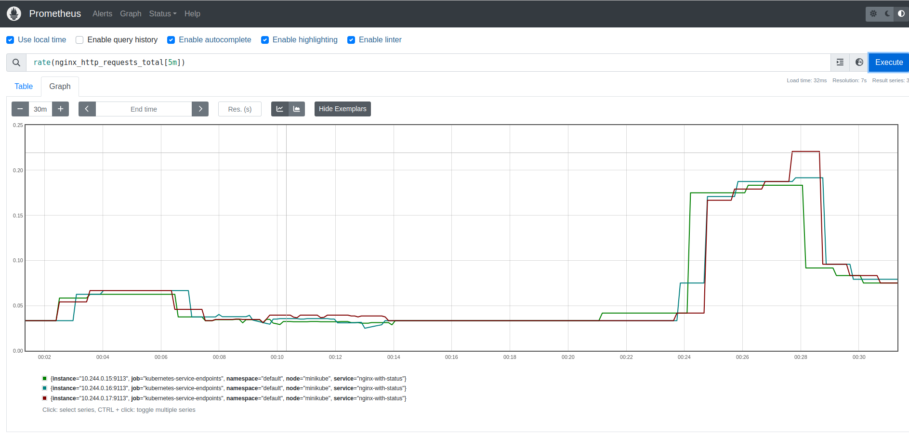
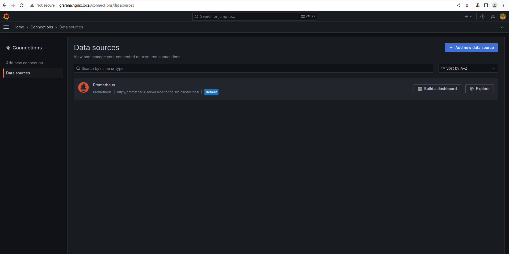
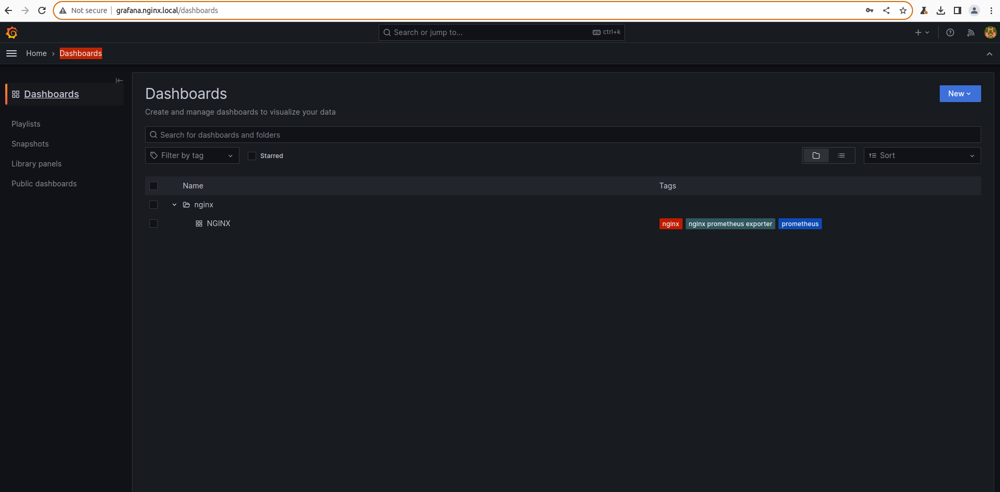
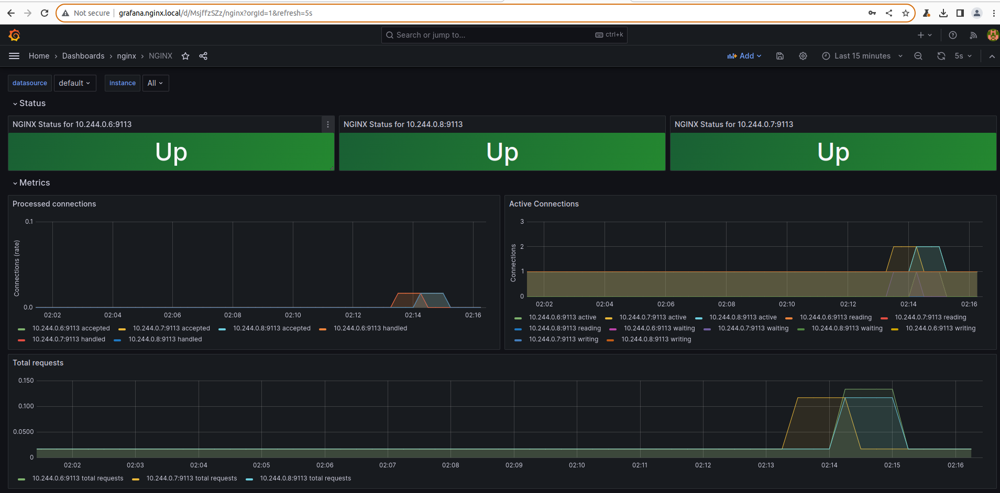

### Задание 1. Сборка кастомного образа
---
**Выполнение**

В директории `./kubernetes-monitoring/nginx/build` находится файл конфигурации `default.conf` с прописанным location `/basic_status` для отображения информации о состоянии NGINX, а также простой Dockerfile для сборки образа с данной конфигурацией и запуска сервера на порту `8080`.

1. Соберем образ и запушим его в DockerHub:
```bash
$ docker build -t vasiilij/nginx-with-status:0.1.0 kubernetes-monitoring/nginx/build
$ docker push vasiilij/nginx-with-status:0.1.0
```
2. Проверим, что локально контейнер запускается и отдаёт нужную информацию:
```bash
$ docker run -d --name nginx-with-status -p 8080:8080 vasiilij/nginx-with-status:0.1.0
$ curl localhost:8080/basic_status
Active connections: 1 
server accepts handled requests
 4 4 16 
Reading: 0 Writing: 1 Waiting: 0
```

### Задание 2. nginx-prometheus-exporter
---
**Выполнение**

В директории `./kubernetes-monitoring/nginx/deploy` находятся манифесты `deployment.yaml` и `service.yaml` для запуска нашего кастомного NGINX и экспортера [NGINX Prometheus Exporter](https://github.com/nginxinc/nginx-prometheus-exporter) в виде сайдкара рядом с сервером NGINX, а также `ingress.yaml` для удобства доступа (и дебага) по URL `status.nginx.local` к стартовой странице NGINX и метрикам с нашего локалхоста.

Запустим наши поды `nginx-with-status` в minikube с включенным аддоном `ingress`:
1. Запустим minikube:
```bash
minikube start --kubernetes-version=v1.27.10
```
2. Включим NGINX Ingress controller:
```bash
minikube addons enable ingress
```
3. Применим манифесты из `./kubernetes-monitoring/nginx/deploy` для деплоя NGINX с экспортером:
```bash
$ kubectl apply -f kubernetes-monitoring/nginx/deploy
deployment.apps/nginx-with-status created
ingress.networking.k8s.io/nginx-with-status created
service/nginx-with-status created
```
4. Дождемся, когда поды поднимутся и ingress получит адрес:
```bash
$ kubectl get ingress -w                                   
NAME                CLASS   HOSTS                ADDRESS   PORTS   AGE
nginx-with-status   nginx   status.nginx.local             80      22s
nginx-with-status   nginx   status.nginx.local   192.168.49.2   80      52s
```
5. Добавим строку `192.168.49.2 status.nginx.local prometheus.nginx.local grafana.nginx.local` в `/etc/hosts` локалхоста и проверим, что метрики доступны по URL'у `http://status.nginx.local/metrics`:


### Задание 3. Деплой Prometheus и Grafana в кластер
---

**Выполнение**

### Деплой Prometheus

Устаналивать Prometheus в кластер будем с помощью helm.

1. Добавим `prometheus-comunity` репозиторий и обновим информацию о чартах:
```bash
helm repo add prometheus-community https://prometheus-community.github.io/helm-charts
helm repo update
```
2. Скачаем чарт `prometheus-community/prometheus` и распакуем его в `./kubernetes-monitoring/monitoring/charts` для наглядности:
```bash
helm pull prometheus-community/prometheus --untar -d ./kubernetes-monitoring/monitoring/charts
```
3. Values для чарта определены в файле `./kubernetes-monitoring/monitoring/values/prometheus.yaml`
4. Установим чарт в неймспейс `monitoring`:
```bash
helm upgrade --install prometheus ./kubernetes-monitoring/monitoring/charts/prometheus -f ./kubernetes-monitoring/monitoring/values/prometheus.yaml --namespace monitoring --create-namespace
```
5. Перейдем в браузере на `http://prometheus.nginx.local` в `Targets`, где увидим наши ендпойнты с метриками:

6. Посмотрим на динамику изменения метрики `nginx_http_requests_total` с наших реплик NGINX:


### Деплой Grafana

Устанавливать Grafana в кластер также будем с помощью helm.

1. Добавим `grafana` репозиторий и обновим информацию о чартах:
```bash
helm repo add grafana https://grafana.github.io/helm-charts
helm repo update
```
2. Скачаем чарт `grafana/grafana` и распакуем его в `./kubernetes-monitoring/monitoring/charts` для наглядности:
```bash
helm pull grafana/grafana --untar -d ./kubernetes-monitoring/monitoring/charts
```
3. Values для чарта определены в файле `./kubernetes-monitoring/monitoring/values/grafana.yaml`
4. В качестве дашборда используем дашборд от NGINX Prometheus Exporter'а ([ссылка](https://github.com/nginxinc/nginx-prometheus-exporter/tree/main/grafana)), который сохраним в директорию `./kubernetes-monitoring/monitoring/charts/grafana/dashboards`
5. Установим чарт в неймспейс `monitoring`:
```bash
helm upgrade --install grafana ./kubernetes-monitoring/monitoring/charts/grafana -f ./kubernetes-monitoring/monitoring/values/grafana.yaml --namespace monitoring
```
6. Перейдем в браузере на `http://grafana.nginx.local` в `Connections -> Data sources`, где увидим наш Prometheus:

7. В Dashboards есть наш дашборд:

8. На дашборде есть панели с графиками:

