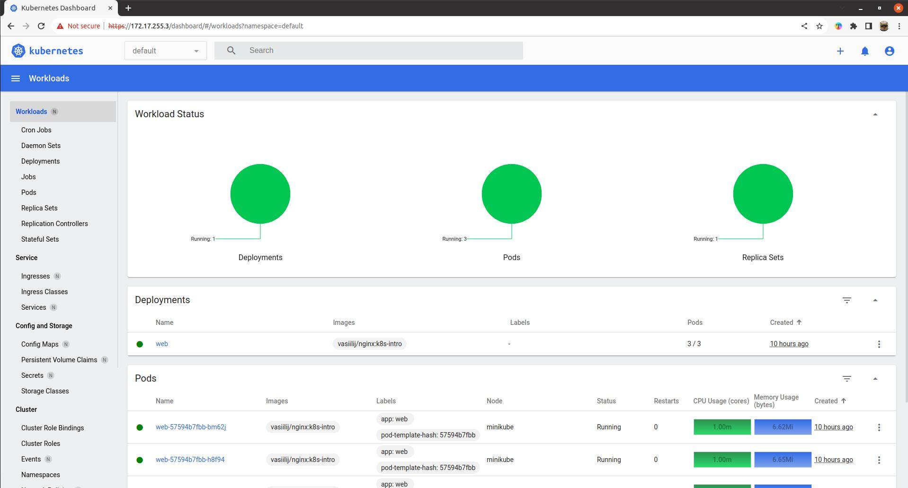

### Добавление проверок Pod
---
**Вопрос:**  
Почему следующая конфигурация валидна, но не имеет смысла?
  
```yaml
livenessProbe:
  exec:
    command:
      - 'sh'
      - '-c'
      - 'ps aux | grep my_web_server_process'
```

**Ответ:**  
Код возврата данной команды всегда будет равен 0, вследствие чего данная livenessProbe всегда будет успешно проходить. Возможно такая проверка будет иметь смысл, если `my_web_server_process` не является основным процессом в поде (то есть его PID не равен 1), но он должен быть запущен в поде после основного. Тогда в этом случае необходимо добавить в команду дополнительную обработку, чтобы `grep` возвращал код `1`, если процесса `my_web_server_process` нет среди запущенных.

### Установка MetalLB
---
MetalLB позволяет запустить внутри кластера L4-балансировщик, который будет принимать извне запросы к сервисам и раскидывать их между подами.  
  
Для его установки нужно:
  
1. Включить `IPVS` в `kube-proxy`, отредактировав `kube-proxy` configmap:
```bash
kubectl edit configmap -n kube-system kube-proxy
```

```yaml
apiVersion: kubeproxy.config.k8s.io/v1alpha1
kind: KubeProxyConfiguration
mode: "ipvs"
ipvs:
  strictARP: true
```

2. Установить Metallb, применив манифест: 
```bash
kubectl apply -f https://raw.githubusercontent.com/metallb/metallb/v0.13.9/config/manifests/metallb-native.yaml
```

3. Далее нужно определить пул IP адресов, которые MetalLB будет назначать сервисам с типом `LoadBalancer`. Сделать это можно, создав ресурс с типом `IPAddressPool` (для Layer 2 режима также нужно создать ресурс `L2Advertisement`):
```bash
kubectl apply -f metallb-config.yaml
```

```yaml
---
apiVersion: metallb.io/v1beta1
kind: IPAddressPool
metadata:
  name: default
  namespace: metallb-system
spec:
  addresses:
    - 172.17.255.1-172.17.255.255

---
apiVersion: metallb.io/v1beta1
kind: L2Advertisement
metadata:
  name: minikube
  namespace: metallb-system
spec:
  ipAddressPools:
    - default
```

### MetalLB | Проверка конфигурации
---
1. Применим манифест `./kubernetes-networks/web-svc-lb.yaml`, который создаст сервис с типом `Loadbalancer`, после чего увидим, что MetalLB назначил нашему сервису IP адрес (`EXTERNAL-IP`) из пула `default`:
```bash
$ kubectl get svc web-svc-lb 
NAME         TYPE           CLUSTER-IP      EXTERNAL-IP    PORT(S)        AGE
web-svc-lb   LoadBalancer   10.105.40.111   172.17.255.1   80:32694/TCP   6s  
```

2. Добавим маршрут в нашей хостовой ОС до подсети `172.17.255.0/24` через IP адрес `Minikube`:
```bash
sudo ip route add 172.17.255.0/24 via 192.168.49.2
```
  
3. Далее можно пройти в браузере на страницу `http://172.17.255.1/index.html` и убедиться, что наше приложение работает.


### Задание со * | DNS через MetalLB
---
В манифесте `./kubernetes-networks/coredns/dns-svc-lb.yaml` описаны два сервиса с типом `Loadbalancer`. Эти сервисы после создания позволяют обращаться к внутрикластернему DNS (CoreDNS) из внешней сети. Так как Kubernetes в настоящее время не поддерживает мультипротокольные сервисы LoadBalancer, то для каждого протокола (TCP и UDP) необходимо создать свой сервис. Но чтобы этим сервисам был назначен один и тот же IP адрес, нужно в аннотации `metallb.universe.tf/allow-shared-ip` указать одинаковый общий ключ.

После применения манифеста `./kubernetes-networks/coredns/dns-svc-lb.yaml` обоим сервисам будет назначен одинаковый IP адрес:
```bash
$ kubectl get svc -n kube-system                 
NAME             TYPE           CLUSTER-IP       EXTERNAL-IP    PORT(S)                  AGE
dns-svc-lb-tcp   LoadBalancer   10.99.195.178    172.17.255.2   53:31644/TCP             13s
dns-svc-lb-udp   LoadBalancer   10.102.217.198   172.17.255.2   53:30531/UDP             13s
```

Теперь мы можем получить IP адрес, назначенный какому-либо сервису, обратившись к CoreDNS кластера, например:
```bash
$ nslookup web-svc-lb.default.svc.cluster.local 172.17.255.2
Server:		172.17.255.2
Address:	172.17.255.2#53
Name:	web-svc-lb.default.svc.cluster.local
Address: 10.105.40.111  
```

### Создание Ingress
---
1. Для установки NGINX ingress контроллера применим манифест:
```bash
kubectl apply -f https://raw.githubusercontent.com/kubernetes/ingress-nginx/controller-v1.8.2/deploy/static/provider/baremetal/deploy.yaml
```

Далее дождемся запуска пода с контроллером:
```
$ kubectl get pods -n ingress-nginx -w 
NAME                                        READY   STATUS      RESTARTS   AGE
ingress-nginx-admission-create-gzcwm        0/1     Completed   0          2m3s
ingress-nginx-admission-patch-7xv82         0/1     Completed   0          2m3s
ingress-nginx-controller-79bc9f5df8-l82wx   1/1     Running     0          2m3s
```
  
2. Создадим `LoadBalancer` сервис `ingress-nginx`:
```bash
kubectl apply -f nginx-lb.yaml
```

Проверим, что MetalLB назначил сервису IP адрес:
```bash
$ kubectl -n ingress-nginx get svc                                                                        
NAME                                 TYPE           CLUSTER-IP      EXTERNAL-IP    PORT(S)                      AGE
ingress-nginx                        LoadBalancer   10.110.20.187   172.17.255.3   80:31497/TCP,443:30753/TCP   17s
ingress-nginx-controller             NodePort       10.98.0.50      <none>         80:30747/TCP,443:31679/TCP   7m38s
ingress-nginx-controller-admission   ClusterIP      10.109.153.7    <none>         443/TCP                      7m38s
```
  
3. Создадим Headless-сервис для проксирования запросов в наше приложение. Headless-сервис - это просто А-запись в CoreDNS, т.е. имя сервиса преобразуется не в виртуальный IP (как раз его нет - `clusterIP: None` в манифесте), а сразу в IP нужного пода. Применим манифест `./kubernetes-networks/web-svc-headless.yaml` и убедимся, что ClusterIP действительно не был назначен:
```bash
kubectl apply -f web-svc-headless.yaml
```

```bash
$ kubectl get svc web-svc               
NAME      TYPE        CLUSTER-IP   EXTERNAL-IP   PORT(S)   AGE
web-svc   ClusterIP   None         <none>        80/TCP    54s  
```

4. Создадим ресурс `Ingress` из манифеста `./kubernetes-networks/web-ingress.yaml` для того, чтобы в конфигурации ingress-контроллера появились нужные правила:
```bash
kubectl apply -f web-ingress.yaml
```

Проверим, что корректно заполнены Address и Backends:
```bash
$ kubectl describe ingress/web
Name:             web
Labels:           <none>
Namespace:        default
Address:          192.168.49.2
Ingress Class:    <none>
Default backend:  <default>
Rules:
  Host        Path  Backends
  ----        ----  --------
  *           
              /web(/|$)(.*)   web-svc:8000 (10.244.0.4:8000,10.244.0.5:8000,10.244.0.6:8000)
Annotations:  kubernetes.io/ingress.class: nginx
              nginx.ingress.kubernetes.io/rewrite-target: /$2
Events:
  Type    Reason  Age                  From                      Message
  ----    ------  ----                 ----                      -------
  Normal  Sync    54s (x4 over 5m52s)  nginx-ingress-controller  Scheduled for sync
```

5. Теперь можно проверить, что приложение доступно в браузере по адресу `http://172.17.255.3/web/index.html`.

### Задание со * | Ingress для Dashboard
---
1. Для установки Dashboard применим манифесты из директории `./kubernetes-networks/dashboard` (за основу манифестов взят [официальный манифест](https://raw.githubusercontent.com/kubernetes/dashboard/v2.7.0/aio/deploy/recommended.yaml) по установке Dashboard):
```bash
kubectl apply -f dashboard/namespace.yaml && sleep 2 && kubectl apply -f dashboard
```

2. Для доступа к Dashboard через Ingress-контроллер (через префикс `/dashboard`) описан Ingress ресурс в манифесте `./kubernetes-networks/dashboard/ingress.yaml`

3. После создания всех ресурсов в кластере необходимо получить токен от сервис-аккаунта `admin-user`. Сделать это можно командой:
```bash
kubectl get secret admin-user -n kubernetes-dashboard -o jsonpath={".data.token"} | base64 -d
```
  
4. Далее можно выполнить вход в Dasboard в браузере на странице `https://172.17.255.3/dashboard`, введя полученный токен:


### Задание со * | Canary для Ingress
---
Для реализации канареечного развертывания с помощью ingress-nginx были написаны манифесты в директории `./kubernetes-networks/canary`. После их применения в нэймспейсе `canary` будут созданы ресурсы для `app-main` и `app-canary` приложений, которые по факту являются веб-серверами NGINX, отдающими страницу, содержащую имя хоста, IP-адрес и порт, а также URI запроса и местное время веб-сервера.

1. Применим манифесты:
```bash
kubectl apply -f canary/namespace.yaml && sleep 2 && kubectl apply -f canary
```

2. Проверим созданные ресурсы:
```bash
$ kubectl -n canary get all && kubectl -n canary get ingress
NAME                             READY   STATUS    RESTARTS   AGE
pod/app-canary-86fdf78c8-jjxfw   1/1     Running   0          5m3s
pod/app-main-5857f664f-c2g7q     1/1     Running   0          5m3s

NAME                 TYPE        CLUSTER-IP   EXTERNAL-IP   PORT(S)    AGE
service/app-canary   ClusterIP   None         <none>        8000/TCP   5m3s
service/app-main     ClusterIP   None         <none>        8000/TCP   5m3s

NAME                         READY   UP-TO-DATE   AVAILABLE   AGE
deployment.apps/app-canary   1/1     1            1           5m3s
deployment.apps/app-main     1/1     1            1           5m3s

NAME                                   DESIRED   CURRENT   READY   AGE
replicaset.apps/app-canary-86fdf78c8   1         1         1       5m3s
replicaset.apps/app-main-5857f664f     1         1         1       5m3s
NAME     CLASS   HOSTS   ADDRESS        PORTS   AGE
canary   nginx   *       192.168.49.2   80      19s
main     nginx   *       192.168.49.2   80      19s
```

3. Ingress с canary развертыванием описан в файле `./kubernetes-networks/canary/ingress-canary.yaml`. Благодаря этому Ingress трафик с заголовком `canary` будет попадать на приложение `app-canary`, в то время как трафик без этого заголовка пойдет на приложение `app-main`:

Сначала отправим запросы с хедером `canary` с различными значениями и убедимся, что ответ приходит от приложения `app-canary`:
```bash
$ curl -s -H "canary: 1" http://172.17.255.3/canary 
Server address: 10.244.0.21:8080
Server name: app-canary-6684864d55-4b2nn
Date: 25/Sep/2023:21:16:18 +0000
URI: /
Request ID: 2829ee866139dfbca468fc729d4c6296

$ curl -s -H "canary: 2" http://172.17.255.3/canary
Server address: 10.244.0.21:8080
Server name: app-canary-6684864d55-4b2nn
Date: 25/Sep/2023:21:16:22 +0000
URI: /
Request ID: 81b44c0e64e23c6d81c644523e5a2457

$ curl -s -H "canary: test" http://172.17.255.3/canary
Server address: 10.244.0.21:8080
Server name: app-canary-6684864d55-4b2nn
Date: 25/Sep/2023:21:16:27 +0000
URI: /
Request ID: bb54bb77012a593d1d00e6cc251fb2fa
```

Теперь отправим запросы с любым хедером и без него и убедимся, что ответ приходит от приложения `app-main`:
```bash
$ curl -s -H "sparrow: captain" http://172.17.255.3/canary
Server address: 10.244.0.22:8080
Server name: app-main-8bbb965c4-fbpzp
Date: 25/Sep/2023:21:19:01 +0000
URI: /
Request ID: 1c384632a303ac7b2bca1cb218f1f3f4

$ curl -s -H "x: y" http://172.17.255.3/canary
Server address: 10.244.0.22:8080
Server name: app-main-8bbb965c4-fbpzp
Date: 25/Sep/2023:21:19:11 +0000
URI: /
Request ID: 5be2fa5ba4f27a7b44c1bdae66c14814

$ curl -s http://172.17.255.3/canary 
Server address: 10.244.0.22:8080
Server name: app-main-8bbb965c4-fbpzp
Date: 25/Sep/2023:21:19:17 +0000
URI: /
Request ID: a73ea4beff282ae51e753fee31821d4f
```
