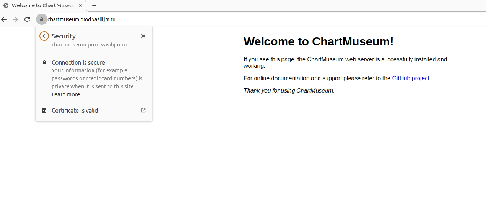
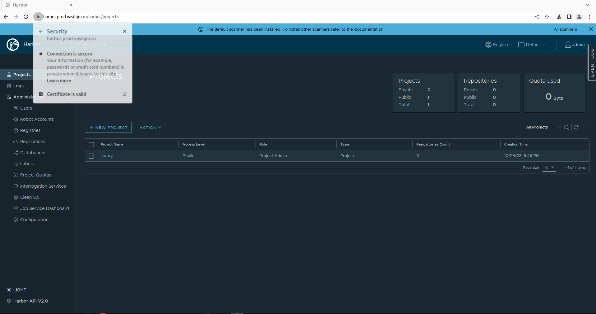
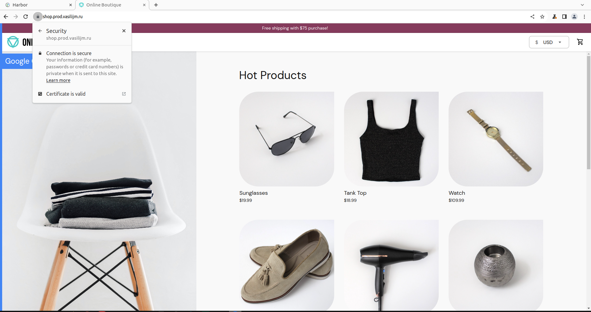
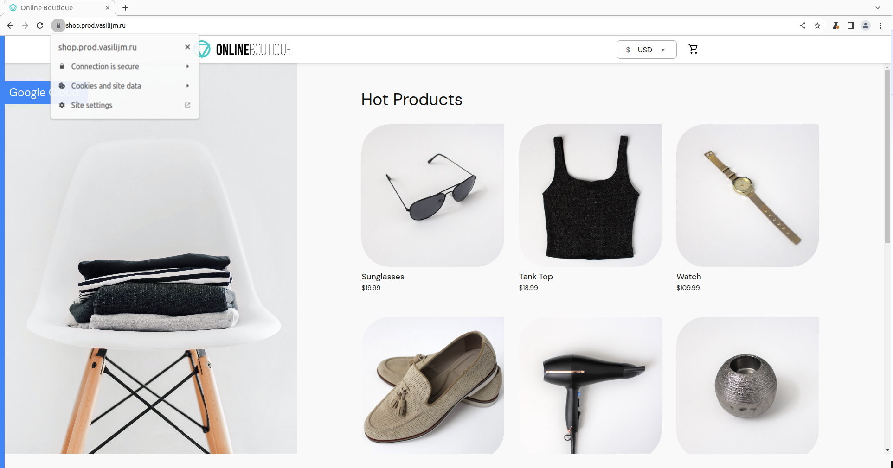
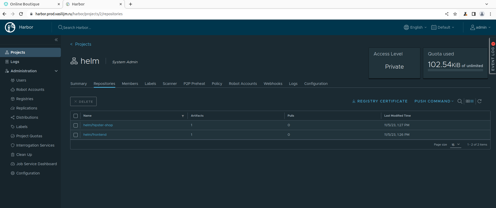

### Задание 1. nginx-ingress
---
**Выполнение**  

1. Добавим репозиторий `ingress-nginx`:
```bash
helm repo add ingress-nginx https://kubernetes.github.io/ingress-nginx
helm repo update
```
2. Создадим release `ingress-nginx` с одновременным созданием namespace для него:
```bash
helm install ingress-nginx ingress-nginx/ingress-nginx --namespace ingress-nginx --create-namespace --version 4.8.2 --set controller.service.loadBalancerIP="158.160.47.79"
```
3. Проверим, что ingress-контроллер запущен:
```bash
$ kubectl get pods -n ingress-nginx    
NAME                                        READY   STATUS    RESTARTS   AGE
ingress-nginx-controller-667587fcc7-whks7   1/1     Running   0          78s
```

### Задание 2. cert-manager
---
**Выполнение**  

1. Добавим репозиторий `jetstack`:
```bash
helm repo add jetstack https://charts.jetstack.io
helm repo update
```
2. cert-manager требует наличия в кластере определенных CRD, установим их:
```bash
kubectl apply -f https://github.com/cert-manager/cert-manager/releases/download/v1.13.1/cert-manager.crds.yaml
```
3. Создадим release `cert-manager` с одновременным созданием namespace для него:
```bash
helm upgrade --install cert-manager jetstack/cert-manager --namespace cert-manager --create-namespace --version v1.13.1 --wait
```
4. После установки `cert-manager` необходимо добавить `Issuer` или `ClusterIssuer` (то же что `Issuer`, но с его помощью можно выпускать сертификаты в любом namespace кластера). Это ресурсы, которые представляют центры сертификации (CAs), способные генерировать подписанные сертификаты в ответ на запросы на подпись (certificate signing requests, CSR).   
   
Манифесты ресурса `ClusterIssuer`, который будет отвечать на HTTP01 challenges при выпуске сертификатов, описаны в файлах `./kubernetes-templating/cert-manager/cluster-issuer-le-staging.yaml` (для выпуска сертификатов от Let's Encrypt в тестовых сценариях) и `./kubernetes-templating/cert-manager/cluster-issuer-le-prod.yaml` (для выпуска сертификатов от LetsEncrypt в prod сценариях).

Применим эти манифесты:
```bash
kubectl apply -f ./kubernetes-templating/cert-manager/cluster-issuer-le-staging.yaml -f ./kubernetes-templating/cert-manager/cluster-issuer-le-prod.yaml
```

### Задание 3. chartmuseum
---
**Выполнение**  

1. Добавим репозиторий `chartmuseum`:
```bash
helm repo add chartmuseum https://chartmuseum.github.io/charts
helm repo update
```

2. В файле `./kubernetes-templating/chartmuseum/values.yaml` описаны параметры для деплоя chartmuseum с помощью helm чарта. В этих значениях я настроил:
   1. Создание ingress ресурса с `hosts.name` `chartmuseum.prod.vasilijm.ru` (поддомен `prod.vasilijm.ru` я делегировал под управление Yandex Cloud DNS)
   2. Автоматическую генерацию Let's Encrypt сертификата

3. Создадим release `chartmuseum` с одновременным созданием namespace для него:
```bash
helm upgrade --install chartmuseum chartmuseum/chartmuseum -f ./kubernetes-templating/chartmuseum/values.yaml --namespace chartmuseum --create-namespace --version 3.1.0 --wait
```

4. Проверим, что соединение с `chartmuseum.prod.vasilijm.ru` защищено (т.е. сертификат от Let's Encrypt получен с помощью cert-manager):


### Задание 4 со *. chartmuseum - Научитесь работать с chartmuseum
---
**Выполнение**  

Для работы с chartmuseum из helm есть [helm-push plugin](https://github.com/chartmuseum/helm-push)
1. Установим его:
```bash
helm plugin install https://github.com/chartmuseum/helm-push
```
2. Добавим репозиторий `myrepo`:
```bash
$ helm repo add myrepo https://chartmuseum.prod.vasilijm.ru
"myrepo" has been added to your repositories
```
3. Запушим в репозиторий `myrepo` чарт `ingress-nginx`, который сохранен локально как директория с соответствующей для данного чарта структурой:
```bash
$ helm cm-push ../misc/helm-charts/ingress-nginx/ myrepo        
Pushing ingress-nginx-4.8.2.tgz to myrepo...
Done.
```
4. После обновления информации о helm репозиториях (`helm repo update`) можно увидеть, что в `myrepo` появился чарт `myrepo/ingress-nginx`:
```bash
$ helm search repo myrepo/
NAME                	CHART VERSION	APP VERSION	DESCRIPTION                                       
myrepo/ingress-nginx	4.8.2        	1.9.3      	Ingress controller for Kubernetes using NGINX a...
```
5. Теперь можно будет установить данный чарт командой `helm install ingress-nginx myrepo/ingress-nginx`.

### Задание 5. harbor
---
**Выполнение** 

1. Добавим репозиторий `harbor`:
```bash
helm repo add harbor https://helm.goharbor.io
helm repo update
```
2. Для установки harbor используем параметры, указанные в файле `./kubernetes-templating/harbor/values.yaml`. Среди параметров:
   1. Включен `ingress` и настроен `host` `harbor.prod.vasilijm.ru`
   2. Включен TLS и выписан валидный сертификат
   3. Сервис `notary` выключен за ненадобностью
   4. Выключен IPv6

Создадим release `harbor` с одновременным созданием namespace для него:
```bash
helm upgrade --install harbor harbor/harbor -f ./kubernetes-templating/harbor/values.yaml --namespace harbor --create-namespace --version 1.13.0 --wait
```
3. Проверим, что соединение с `harbor.prod.vasilijm.ru` защищено (т.е. сертификат от Let's Encrypt получен с помощью cert-manager):


### Задание 6 со *. используем helmfile
---
**Выполнение**  

Для одновременной установки `nginx-ingress`, `cert-manager` и `harbor` можно использовать helmfile `./kubernetes-templating/helmfile/helmfile.yaml`

1. Установка `helmfile`:
```bash
curl -L -O https://github.com/helmfile/helmfile/releases/download/v0.158.0/helmfile_0.158.0_linux_amd64.tar.gz
```
```bash
tar xvf /tmp/helmfile_0.158.0_linux_amd64.tar.gz
```
```bash
sudo mv helmfile /usr/local/bin
```
```bash
$ helmfile version

▓▓▓ helmfile

Version            0.158.0
Git Commit         9596790
Build Date         23 Oct 23 05:57 MSK (6 days ago)
Commit Date        23 Oct 23 00:51 MSK (6 days ago)
Dirty Build        no
Go version         1.21.3
Compiler           gc
Platform           linux/amd64
```
2. Находясь в директории `./kubernetes-templating/helmfile`, выполним следующие команды:
   1. Установим необходимые зависимости (это установит необходимые helm плагины):
```bash
helmfile init --force
```
   2. Выполним обновление релизов:
```bash
helmfile sync
```
<details>
  <summary><b>Лог установки</b></summary>

  ```bash  
  Adding repo ingress-nginx https://kubernetes.github.io/ingress-nginx
  "ingress-nginx" has been added to your repositories

  Adding repo jetstack https://charts.jetstack.io
  "jetstack" has been added to your repositories

  Adding repo harbor https://helm.goharbor.io
  "harbor" has been added to your repositories

  Upgrading release=cert-manager, chart=jetstack/cert-manager
  Upgrading release=ingress-nginx, chart=ingress-nginx/ingress-nginx
  Upgrading release=harbor, chart=harbor/harbor
  Release "cert-manager" does not exist. Installing it now.
  NAME: cert-manager
  LAST DEPLOYED: Sun Nov  5 11:30:07 2023
  NAMESPACE: cert-manager
  STATUS: deployed
  REVISION: 1
  TEST SUITE: None
  NOTES:
  cert-manager v1.13.1 has been deployed successfully!

  In order to begin issuing certificates, you will need to set up a ClusterIssuer
  or Issuer resource (for example, by creating a 'letsencrypt-staging' issuer).

  More information on the different types of issuers and how to configure them
  can be found in our documentation:

  https://cert-manager.io/docs/configuration/

  For information on how to configure cert-manager to automatically provision
  Certificates for Ingress resources, take a look at the `ingress-shim`
  documentation:

  https://cert-manager.io/docs/usage/ingress/

  Listing releases matching ^cert-manager$
  cert-manager	cert-manager	1       	2023-11-05 11:30:07.33538939 +0300 MSK	deployed	cert-manager-v1.13.1	v1.13.1    

  Release "ingress-nginx" does not exist. Installing it now.
  NAME: ingress-nginx
  LAST DEPLOYED: Sun Nov  5 11:30:07 2023
  NAMESPACE: ingress-nginx
  STATUS: deployed
  REVISION: 1
  TEST SUITE: None
  NOTES:
  The ingress-nginx controller has been installed.
  It may take a few minutes for the LoadBalancer IP to be available.
  You can watch the status by running 'kubectl --namespace ingress-nginx get services -o wide -w ingress-nginx-controller'

  An example Ingress that makes use of the controller:
    apiVersion: networking.k8s.io/v1
    kind: Ingress
    metadata:
      name: example
      namespace: foo
    spec:
      ingressClassName: nginx
      rules:
        - host: www.example.com
          http:
            paths:
              - pathType: Prefix
                backend:
                  service:
                    name: exampleService
                    port:
                      number: 80
                path: /
      # This section is only required if TLS is to be enabled for the Ingress
      tls:
        - hosts:
          - www.example.com
          secretName: example-tls

  If TLS is enabled for the Ingress, a Secret containing the certificate and key must also be provided:

    apiVersion: v1
    kind: Secret
    metadata:
      name: example-tls
      namespace: foo
    data:
      tls.crt: <base64 encoded cert>
      tls.key: <base64 encoded key>
    type: kubernetes.io/tls

  Listing releases matching ^ingress-nginx$
  ingress-nginx	ingress-nginx	1       	2023-11-05 11:30:07.753774222 +0300 MSK	deployed	ingress-nginx-4.8.2	1.9.3      


  hook[postsync] logs | clusterissuer.cert-manager.io/letsencrypt-staging created
  hook[postsync] logs | clusterissuer.cert-manager.io/letsencrypt-prod created
  hook[postsync] logs | 
  Release "harbor" does not exist. Installing it now.
  NAME: harbor
  LAST DEPLOYED: Sun Nov  5 11:30:07 2023
  NAMESPACE: harbor
  STATUS: deployed
  REVISION: 1
  TEST SUITE: None
  NOTES:
  Please wait for several minutes for Harbor deployment to complete.
  Then you should be able to visit the Harbor portal at https://harbor.prod.vasilijm.ru
  For more details, please visit https://github.com/goharbor/harbor

  Listing releases matching ^harbor$
  harbor	harbor   	1       	2023-11-05 11:30:07.413541574 +0300 MSK	deployed	harbor-1.13.0	2.9.0      


  UPDATED RELEASES:
  NAME            CHART                         VERSION   DURATION
  cert-manager    jetstack/cert-manager         v1.13.1        38s
  ingress-nginx   ingress-nginx/ingress-nginx   4.8.2          37s
  harbor          harbor/harbor                 1.13.0       1m49s
  ```

</details>

### Задание 7. Создаем свой helm chart
---
  **Выполнение** 

1. Инициализируем структуру helm чарта:
```bash
helm create kubernetes-templating/hipster-shop
```
2. Создадим релиз:
```bash
helm upgrade --install hipster-shop kubernetes-templating/hipster-shop --namespace hipster-shop --create-namespace
```
3. Создадим отдельный helm чарт для сервиса `frontend` и вынесем в него соответсвтующие ресурсы из `./kubernetes-templating/hipster-shop/templates/all-hipster-shop.yaml`:
```bash
helm create kubernetes-templating/frontend
```
4. Установим релиз `frontend` в нэймспэйс `hipster-shop`:
```bash
helm upgrade --install frontend kubernetes-templating/frontend --namespace hipster-shop
```
5. Проверим, что появился доступ к UI с использованием tls (https://shop.prod.vasilijm.ru):


6. Укажем чарт `frontend` как зависимость в чарте `hipster-shop` (блок `dependencies` в файле `./kubernetes-templating/hipster-shop/Chart.yaml`).  
После чего удалим release `frontend` из кластера:
```bash
helm delete frontend -n hipster-shop
```
7. Обновим зависимости:
```bash
helm dep update kubernetes-templating/hipster-shop
```
В директории `./kubernetes-templating/hipster-shop/charts` появился архив `frontend-0.1.0.tgz` содержащий chart `frontend` версии 0.1.0 и добавленный в chart `hipster-shop` как зависимость.

8. Обновим release `hipster-shop` и убедимся, что ресурсы `frontend` вновь созданы:
```bash
$ helm upgrade --install hipster-shop kubernetes-templating/hipster-shop --namespace hipster-shop                   
Release "hipster-shop" has been upgraded. Happy Helming!
NAME: hipster-shop
LAST DEPLOYED: Sun Oct 29 23:30:17 2023
NAMESPACE: hipster-shop
STATUS: deployed
REVISION: 4
TEST SUITE: None
$
$ kubectl -n hipster-shop get all  | grep frontend
pod/frontend-66985f459-hr87s                 1/1     Running            0              66s
service/frontend                NodePort    10.96.165.236   <none>        80:31000/TCP   68s
deployment.apps/frontend                1/1     1            1           67s
replicaset.apps/frontend-66985f459                 1         1         1       67s
```

### Задание 8 со *. Выберите сервисы, которые можно установить как зависимости, используя community chart's
---
**Выполнение** 

1. Добавим чарт `redis` от bitnami в блок `dependencies` в файле `./kubernetes-templating/hipster-shop/Chart.yaml` и обновим зависимости:
```bash
helm dep update kubernetes-templating/hipster-shop
```
В директории `./kubernetes-templating/hipster-shop/charts` появился архив `redis-18.2.0.tgz` содержащий chart `redis` версии 18.2.0 и добавленный в chart `hipster-shop` как зависимость.

Для сервиса `cartservice` необходимо поменять значение переменной, чтобы он смог установить подключение с redis по имени его сервиса:
```yaml
- name: REDIS_ADDR
  value: "{{ .Values.redis.fullnameOverride }}-master:6379"
```
2. Задеплоим релиз `hipster-shop` и убедимся, что сервис `cartservice` работает без ошибок, так как именно он взаимодейстует с redis:
```bash
$ helm upgrade --install hipster-shop kubernetes-templating/hipster-shop --namespace hipster-shop --create-namespace
```
3. Проверим, что появился доступ к UI с использованием tls (https://shop.prod.vasilijm.ru):


### Задание 9. Работа с helm-secrets
---
**Выполнение** 

Плагин `helm-secrets` используется для хранения в чарте секретов в зашифрованном виде.

1. Установим плагин:
```bash
helm plugin install https://github.com/jkroepke/helm-secrets --version v4.5.1
```
2. Установим Mozilla SOPS:
```bash
# Download the binary
curl -LO https://github.com/getsops/sops/releases/download/v3.8.1/sops-v3.8.1.linux.amd64

# Move the binary in to your PATH
sudo mv sops-v3.8.1.linux.amd64 /usr/local/bin/sops

# Make the binary executable
sudo chmod +x /usr/local/bin/sops 
``` 
3. Сгенерируем новый PGP ключ, ответив в процессе на вопросы:
```bash
gpg --full-generate-key
```
4. Создадим `./kubernetes-templating/frontend/secrets.yaml` со следующим сожержимым:
```yaml
visibleKey: hiddenValue
```
Зашифруем файл:
```bash
sops -e -i --pgp B0FA8EFF80BB979847564414DFD56B4AFBDB33CB ./kubernetes-templating/frontend/secrets.yaml
```
5. Содержимое файла изменилось, значение ключа `visibleKey` теперь зашифровано, плюс появилась дополнительная мета. Для просмотра зашифрованного значения можно воспользоваться одной из следующих команд:
```bash
helm secrets decrypt ./kubernetes-templating/frontend/secrets.yaml
``` 
```bash
sops -d ./kubernetes-templating/frontend/secrets.yaml
```
6. Создадим secret в кластере (секрет описан в манифесте `./kubernetes-templating/frontend/templates/secret.yaml`). Для его создания выполним следующую команду:
```bash
helm secrets upgrade --install frontend kubernetes-templating/frontend --namespace frontend --create-namespace \
-f kubernetes-templating/frontend/values.yaml \
-f kubernetes-templating/frontend/secrets.yaml
```
7. Проверим, что секрет создан:
```bash
$ kubectl -n frontend get secret secret -o yaml
apiVersion: v1
data:
  visibleKey: aGlkZGVuVmFsdWU=
kind: Secret
metadata:
  annotations:
    meta.helm.sh/release-name: frontend
    meta.helm.sh/release-namespace: frontend
  creationTimestamp: "2023-10-30T20:27:26Z"
  labels:
    app.kubernetes.io/managed-by: Helm
  name: secret
  namespace: frontend
  resourceVersion: "42688"
  uid: b8dfdea8-166c-4866-b17e-72187967e026
type: Opaque      
```
8. Q: *Предложите способ использования плагина helm-secrets в CI/CD*  
   A: В репозитории можно держать файлы с зашифрованными секретами, таким образом мы получаем секреты, актуальные для той или иной версии приложения. Затем при деплое с помощью плагина helm-secrets мы можем создавать в кластере kubernetes обеъекты `secret`, где данные будут уже расшифрованы и закодированы в base64.

   Q: *Про что необходимо помнить, если используем helm-secrets (например, как обезопасить себя от коммита файлов с секретами, которые забыл зашифровать)?*  
   A: Нужно проверять, чтобы секрет не попал в репозиторий в незашифрованном виде. В автоматическом режиме это можно реализовать в виде pre-commit хука.

### Задание 10. Проверка. Поместите все получившиеся helm chart's в ваш установленный harbor в публичный проект.
---
**Выполнение** 

У меня не получилось добавить репозиторий harbor командой `helm repo add templating https://harbor.prod.vasilijm.ru/helm`, так как получал ошибку:
```
Error: looks like "https://harbor.prod.vasilijm.ru/helm" is not a valid chart repository or cannot be reached: error unmarshaling JSON: while decoding JSON: json: cannot unmarshal string into Go value of type repo.IndexFile  
```
В итоге работа с helm чартами в Harbor выглядит следующим образом:
1. В Harbor создать проект `helm` для хранения чартов
2. Выполнить `helm login` для логина в репозиторий `helm`:
```bash
$ helm registry login https://harbor.prod.vasilijm.ru/helm --username=admin --password=Harbor12345
WARNING: Using --password via the CLI is insecure. Use --password-stdin.
Login Succeeded
```
3. Создать из директории чарта архив командой `helm package`:
```bash
$ helm package --version 0.1.0 --destination /tmp kubernetes-templating/frontend
Successfully packaged chart and saved it to: /tmp/frontend-0.1.0.tgz
$
$ helm package --version 0.1.0 --destination /tmp kubernetes-templating/hipster-shop 
Successfully packaged chart and saved it to: /tmp/hipster-shop-0.1.0.tgz
```
4. Командой `helm push` загрузить архив чарта в Harbor:
```bash
$ helm push /tmp/frontend-0.1.0.tgz oci://harbor.prod.vasilijm.ru/helm 
Pushed: harbor.prod.vasilijm.ru/helm/frontend:0.1.0
Digest: sha256:0242cfe42fe9ed34a6eaf3984774d20d684705d2f5b0059fd674b4bffc6b5865
$
$ helm push /tmp/hipster-shop-0.1.0.tgz oci://harbor.prod.vasilijm.ru/helm
Pushed: harbor.prod.vasilijm.ru/helm/hipster-shop:0.1.0
Digest: sha256:d536e83df55545dc933d9b9d399cdd4f0fdc669a4d3d9ccd0e548468e61e3ede
```
5. Для загрузки чартов в Harbor написан скрипт `./kubernetes-templating/repo.sh`, например, загрузка чартов `frontend` и `hipster-shop` выглядит следующим образом:
```bash
$ ./kubernetes-templating/repo.sh frontend hipster-shop
WARNING: Using --password via the CLI is insecure. Use --password-stdin.
Login Succeeded
Successfully packaged chart and saved it to: /tmp/frontend-0.1.0.tgz
Pushed: harbor.prod.vasilijm.ru/helm/frontend:0.1.0
Digest: sha256:4367ad434f64e63e47be1e14f6e306095afd641aedc7ed12a0aa10c105fcc127
Successfully packaged chart and saved it to: /tmp/hipster-shop-0.1.0.tgz
Pushed: harbor.prod.vasilijm.ru/helm/hipster-shop:0.1.0
Digest: sha256:0ab636497baa0b160c47611899573671f88ca8a76fa72baab8f4acab58e2ce3c
```
6. Результат можно увидеть в интерфейе Harbor:


### Задание 11. Kubecfg
---
**Выполнение** 

1. Установим `kubecfg`:
```bash
# Download the binary
curl -LO https://github.com/kubecfg/kubecfg/releases/download/v0.34.2/kubecfg_Linux_X64

# Move the binary in to your PATH
sudo mv kubecfg_Linux_X64 /usr/local/bin/kubecfg

# Make the binary executable
sudo chmod +x /usr/local/bin/kubecfg 

# Check version
$ kubecfg version
kubecfg version: v0.34.2
jsonnet version: v0.20.0
client-go version: v0.0.0-master+$Format:%H$
```
2. Шаблон для генерации манифестов описан в файле `./kubernetes-templating/kubecfg/services.jsonnet`. Проверим, что манифесты генерируются корректно и применим их в кластер:
```bash
$ # Проверим, что манифесты генерируются корректно
$ kubecfg show kubernetes-templating/kubecfg/services.jsonnet
$ # Если ошибок нет, то получим в консоли сгенерированные манифесты
$ # Применим манифесты в кластер
$ kubecfg update kubernetes-templating/kubecfg/services.jsonnet --namespace hipster-shop
INFO  Validating deployments paymentservice
INFO  validate object "apps/v1, Kind=Deployment"
INFO  Validating services paymentservice
INFO  validate object "/v1, Kind=Service"
INFO  Validating deployments shippingservice
INFO  validate object "apps/v1, Kind=Deployment"
INFO  Validating services shippingservice
INFO  validate object "/v1, Kind=Service"
INFO  Fetching schemas for 4 resources
INFO  Creating deployments paymentservice
INFO  Creating deployments shippingservice
```
3. Проверим, что нужные сервисы поднялись (в нашем случае это поды `paymentservice-57f6bc9cfb-8w9hr` и `shippingservice-8f75d45b8-79zjg`):
```bash
$ kubectl get po -n hipster-shop                                 
NAME                                     READY   STATUS    RESTARTS   AGE
adservice-7d857689bd-kfbj2               1/1     Running   0          9h
cartservice-56578677d-dflcm              1/1     Running   0          9h
checkoutservice-84cb944764-jv68d         1/1     Running   0          9h
currencyservice-76f9b766b4-8tgrq         1/1     Running   0          9h
emailservice-767cd45966-flhwm            1/1     Running   0          9h
frontend-8475b5657d-jzk6b                1/1     Running   0          9h
loadgenerator-6d79d6ff6f-m2ff4           1/1     Running   0          9h
paymentservice-57f6bc9cfb-8w9hr          1/1     Running   0          4m56s
productcatalogservice-5b9df8d49b-fjsgv   1/1     Running   0          9h
recommendationservice-6ffb84bb94-9cpmk   1/1     Running   0          9h
redis-cart-master-0                      1/1     Running   0          9h
shippingservice-8f75d45b8-79zjg          1/1     Running   0          4m56s  
```

### Задание 12. Kustomize | Самостоятельное задание
---
**Выполнение** 

1. Для выполнения задания "отпилим" из `./kubernetes-templating/hipster-shop/templates/all-hipster-shop.yaml` сервис `currencyservice`.
2. Манифесты для создание базовых ресурсов (`deployment` и `service` в нэймспейсе `hipster-shop`) описаны в директории `./kubernetes-templating/kustomize/base`. Для их применения в кластере выполним следующую команду:
```bash
$ kubectl apply -k kubernetes-templating/kustomize/base
service/currencyservice created
deployment.apps/currencyservice created
```
3. Перед применением манифестов в `prod` окружение (директория `./kubernetes-templating/kustomize/overlays/prod`) мы можем посмотреть, какие именно манифесты будут сгенерированы, выполнив:
```bash
kubectl kustomize kubernetes-templating/kustomize/overlays/prod
```
4. Установка на `prod` окружение (`hipster-shop-prod` нэймспейс) будет выглядеть следующим образом:
```bash
$ kubectl apply -k kubernetes-templating/kustomize/overlays/prod
namespace/hipster-shop-prod created
service/prod-currencyservice created
deployment.apps/prod-currencyservice created
$ kubectl get pods -n hipster-shop-prod                         
NAME                                    READY   STATUS    RESTARTS   AGE
prod-currencyservice-6895bf9fd7-lhtw8   1/1     Running   0          24s
```
